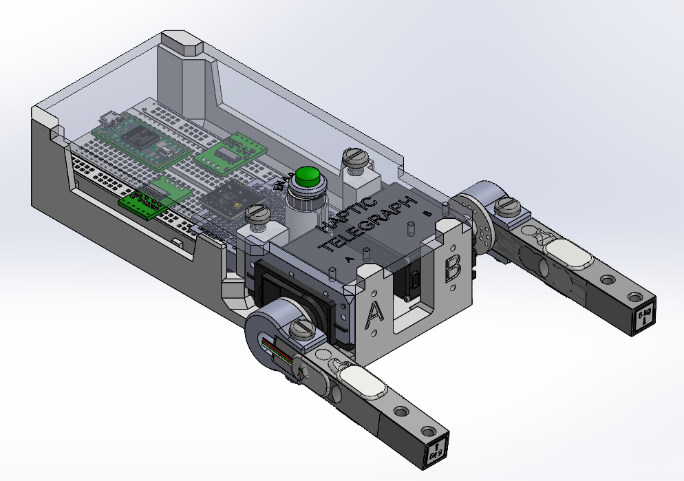
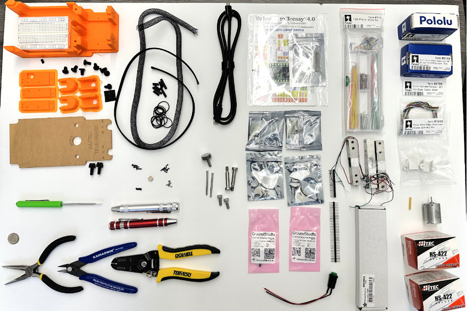
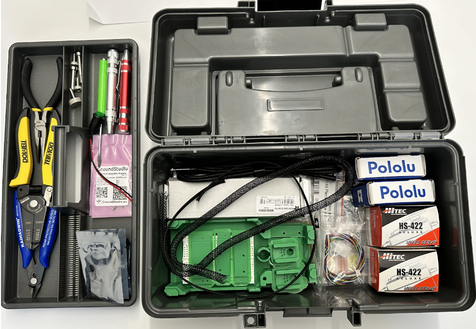

# HapticTelegraph Teleoperation With Variable Time Delay

Our project uses the haptic telegraph used in class and the assembly instructions are linked below. The haptic telegraph consists of 2 hobby servos, 2 load cells to measure forces applied on the operator control (load cell A) and the end effector (load cell B), and a teensy 4.0 microcontroller is used to receive and send force values from the servos as well as interface with the computer over serial connection.  The purpose of this project is to investigate how variable time delay (unstable internet connection) will effect teleoperation, specifically looking at how it effects operator confidence via task completion time and how smoothly the task can be completed. 

 

## Building and Assembly  

[Haptic Telegraph Assembly Guide](https://docs.google.com/document/d/17Dt6qZLQLV2zLom0jG1yqs2Jcs7Xk3iRWMrtn3mGbbk/preview)

[BOM and Kit Inventory](https://docs.google.com/spreadsheets/d/1TIM3guZMqlwLRaXGF0uH3Ged3IqBKqTgrUTtAIh1ZG8/preview)

## Software and Firmware
The python scripts and c program provided allow for simulating teleoperated control over udp with variable time delay. The python script handles locally sending data over udp and adding an artifical variable time delay. The c program interfaces the teensy with the computer by reading and writing forces to/from the servos and to/from the computer. 

The operator interfaces with the telegraph by applying force on load cell A. This force is immediately sent by the teensy over serial to the computer where it is sent locally over UDP and then held for a delay time determined by a value sampled from a gaussian distribution with the mean being the base latency and the variance being the desired latency variance. This force is then sent back to the teensy over serial and immediately applied to servo B. The same process happens for forces applied to servo B so the force felt on servo B is then felt on servo A delayed by the sampled latency.  

Operation Instructions:
1. Install the anaconda environment found in environment.yaml
2. Connect the teensy to the COM3 serial port on your computer. 
3. Upload the file found at "ME8284GroupEmber/firmware/HapticTelegraph_Diagnostics/HapticTelegraph_Diagnostics.ino" to the teensy using the arduino IDE
4. IMPORTANT: Close the serial monitor in the arduino IDE so that it releases the serial port. The python script will not be able to read or write to the serial port while this is open.
   You can do this by going to the tools tab and selecting "Serial Monitor". A window at the bottom of the IDE should open and be printing readings from the teensy. Click on the X on the serial monitor window to close it.
   The serial port should now be open for the python script to access.
5. Select the desired base latency and latency varience by editing lines 25 and 26 in udp_csv_write.py (values are in seconds)
6. You can now run udp_csv_write.py by navigating to the software directory where the script is located and in a terminal typing "python udp_csv_write.py" (full path - "ME8284GroupEmber/software/udp_csv_write")
7. Make sure the large button on the top of the haptic telegraph is pressed down and the haptic telegraph should now be operational.
8. Pressing and holding down the "R" key on your keyboard will cause the python script to begin recording force values applied on load cell A and B. Releasing the key will write the collected force values to a csv file for further analysis

### Info
ME8284 Intermediate Robotics with Medical Applications Graduate Level Course  
University of Minnesota Mechanical Engineering, Fall 2024  
Group Ember
Steven Bleau - Manager  - bleau005@umn.edu  
Tanishq Kondru - Mechanical Lead - kondr047@umn.edu  
Bhushan Ravikumar - Embedded Lead - ravik039@umn.edu  
Christian Eidahl - Software Lead - eidah008@umn.edu 

